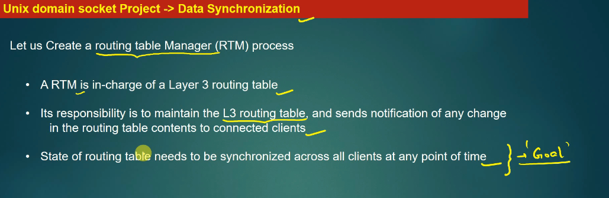
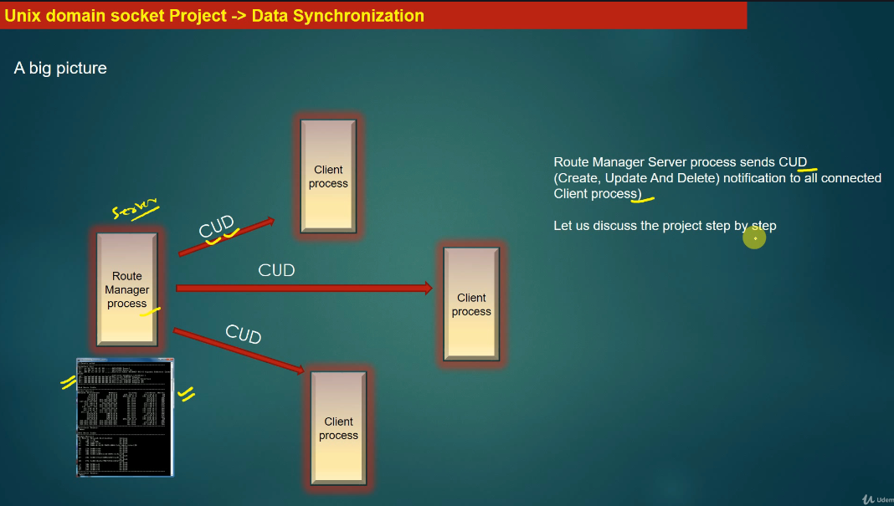
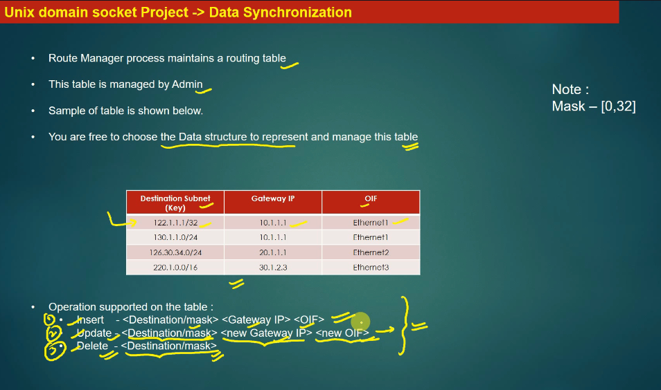
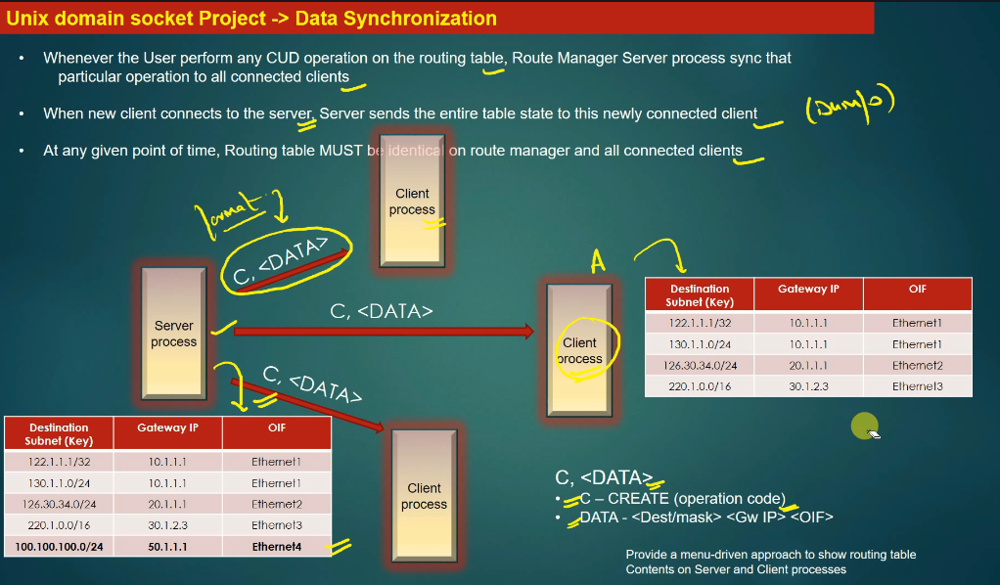
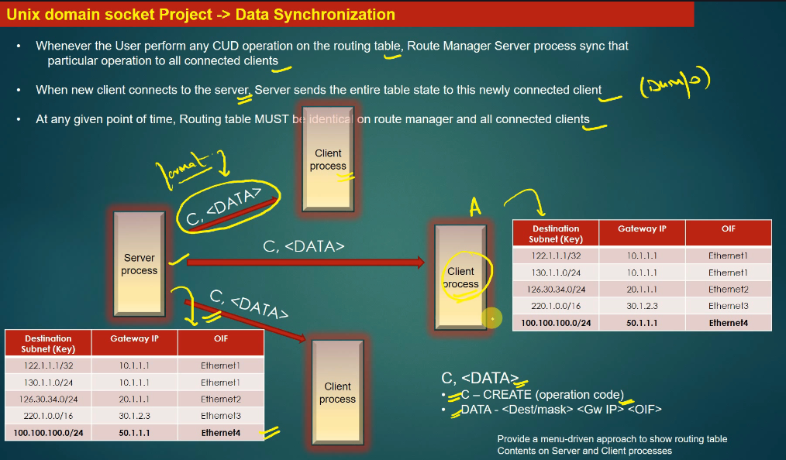
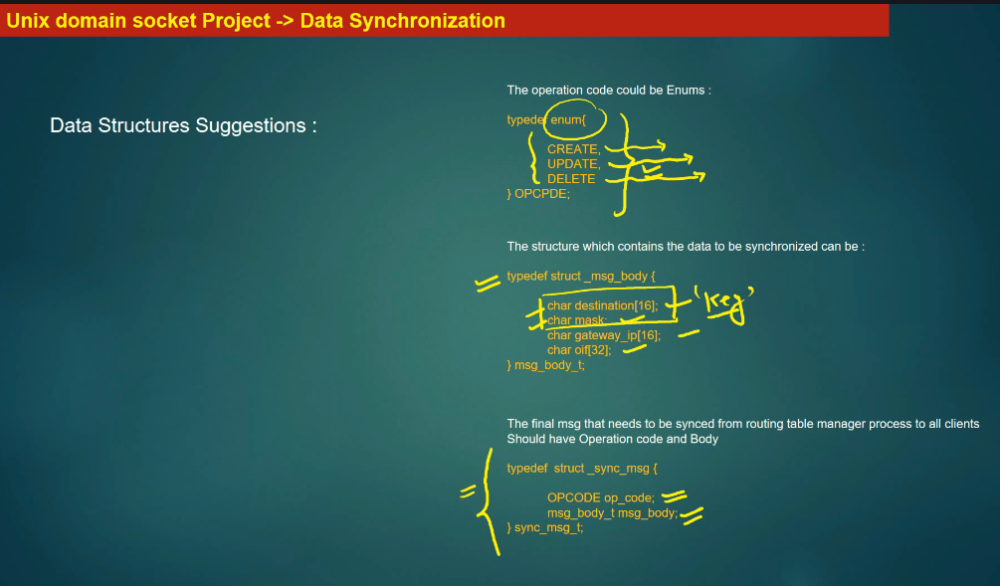
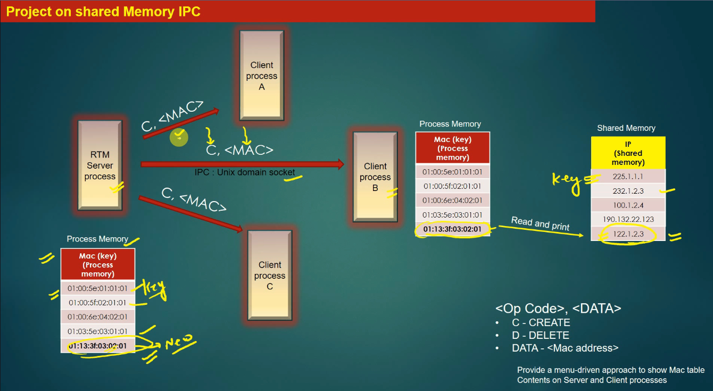
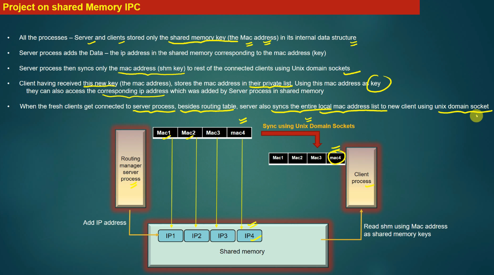

RTL: Routing Table  Layer
Simply: a Server notification to all Clients
Server can Create/Update/Delete an entry in Routing Table

Each Routing is an entry in Routing Table (Linked List)

------------------------------------------------------------------

