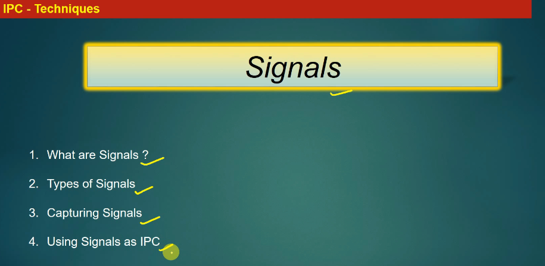
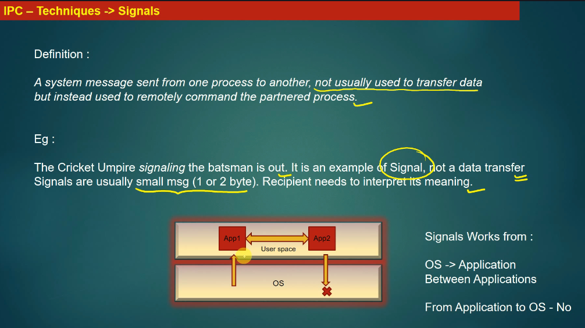
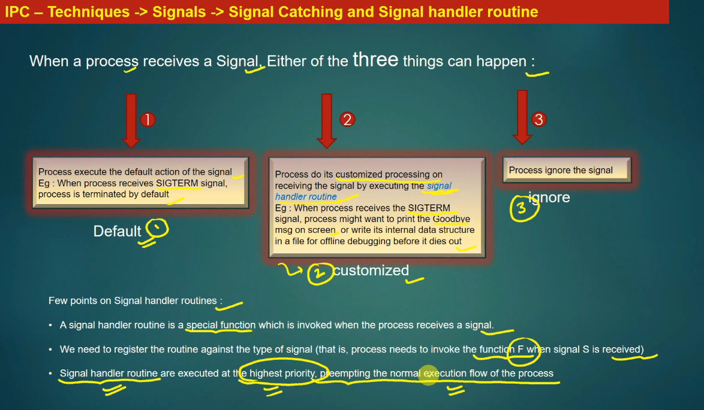
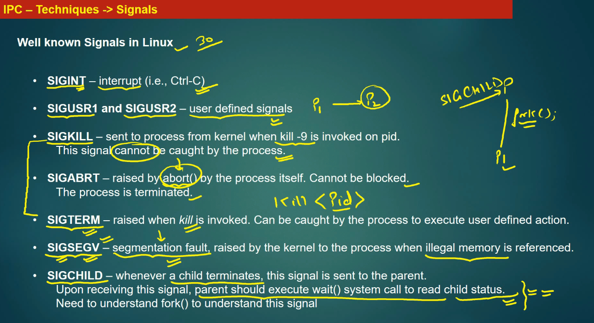
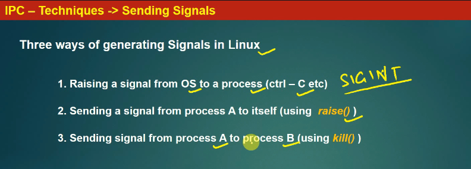
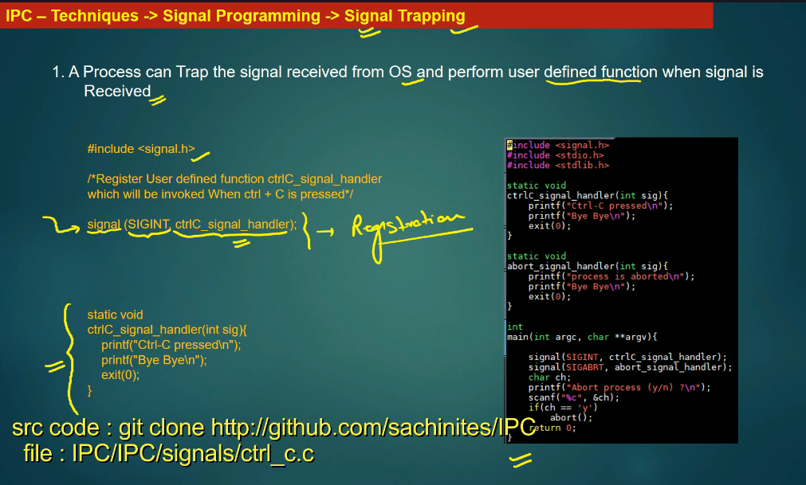
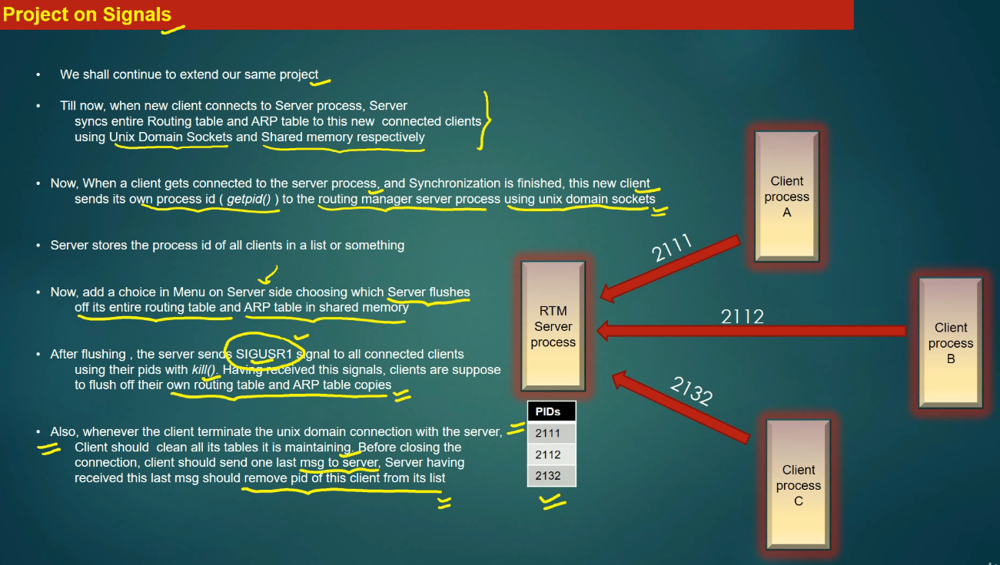

cricket umpire : A cricket umpire is an official who enforces the Laws of Cricket,


Signal is sent from 
OS --> App
App --> OS
App1 --> App2



When process receive a signal:, process have 3 type of action
1- by default 
2- customized SIgnal Handle routine 
3- ignore the signal 




-------------------------------------------------------------




Below is a **clear summary** of the lecture, followed by **senior-developer comments and corrections** that will help you understand signals *accurately*, not just conceptually.

---

## 1. Summary of the Lecture

### What are Linux signals?

* Signals are a **lightweight IPC and control mechanism** used by the Linux kernel to notify a process that an event has occurred.
* Linux supports **~30 standard signals** (more if you include real-time signals).

---

### Well-known Linux signals discussed

#### **SIGINT (Interrupt)**

* Generated when user presses **Ctrl + C**
* Default behavior: **terminate the process**
* Can be **caught and handled** to perform cleanup or custom logic

---

#### **SIGUSR1 / SIGUSR2**

* **User-defined signals**
* No predefined semantic meaning by Linux
* Intended for **application-specific signaling**
* Can be sent using `kill -SIGUSR1 <pid>`
* Can be **caught and customized**

---

#### **SIGKILL**

* Sent using `kill -9 <pid>`
* **Cannot be caught, blocked, or ignored**
* Process is terminated **immediately**
* Used as a **last resort** when a process is unresponsive

---

#### **SIGABRT**

* Raised by calling `abort()`
* Indicates a **fatal internal error**
* Cannot be blocked
* Terminates the process and often produces a **core dump**

---

#### **SIGTERM**

* Default signal sent by `kill <pid>`
* Requests **graceful termination**
* Can be caught and handled
* Widely used by init systems (systemd, init scripts)

---

#### **SIGSEGV (Segmentation Fault)**

* Raised when a process accesses **invalid memory**
* Typical causes:

  * NULL pointer dereference
  * Buffer overflow
  * Use-after-free
* Default behavior: terminate process
* Kernel-generated signal

---

#### **SIGCHLD**

* Sent to a parent process when a **child process exits**
* Used with `wait()` / `waitpid()` to:

  * Reap zombie processes
  * Retrieve exit status
* Essential for correct **process lifecycle management**

---

## 2. Senior Developer Comments & Corrections

This lecture is **good for beginners**, but there are **important inaccuracies and missing depth**.

---

### 🔴 Correction 1: “~30 signals”

✔ Correct in spirit
⚠ In reality:

* Standard POSIX signals: **31**
* Linux adds **real-time signals**: `SIGRTMIN` → `SIGRTMAX`
* Total can exceed **60+ signals**

---

### 🔴 Correction 2: “SIGSEGV cannot be caught”

❌ Incorrect

✔ **SIGSEGV *can* be caught** using `sigaction()`
✔ Debuggers and crash handlers rely on this
✔ But:

* Continuing execution is usually unsafe
* Default behavior is termination

Example:

```c
signal(SIGSEGV, handler);
```

---

### 🔴 Correction 3: “SIGABRT cannot be caught”

❌ Incorrect

✔ SIGABRT **can be caught**
✔ But if the handler returns, the process is terminated anyway
✔ Common use:

* Log crash details
* Generate core dump

---

### 🔴 Correction 4: SIGKILL explanation

✔ Correct conceptually
But add:

* SIGKILL bypasses:

  * Signal handlers
  * Cleanup routines
  * `atexit()` handlers
* Can leave:

  * Locked files
  * Shared memory leaks
  * Inconsistent state

➡ **Never use SIGKILL unless absolutely necessary**

---

### 🔴 Correction 5: SIGTERM vs SIGKILL

The lecture says they are “not very different” — this is misleading.

| Signal  | Can be caught | Graceful | Recommended    |
| ------- | ------------- | -------- | -------------- |
| SIGTERM | ✅ Yes         | ✅ Yes    | ✅ First choice |
| SIGKILL | ❌ No          | ❌ No     | ❌ Last resort  |

---

### 🔴 Correction 6: SIGCHLD handling

Missing key senior insight:

* If parent **does not call `wait()`**, child becomes a **zombie**
* Zombies consume PID table entries
* Proper SIGCHLD handling is critical in:

  * Daemons
  * Servers
  * Supervisors

---

## 3. What the Lecture Did Well

✔ Clear beginner explanation
✔ Correct intuition for most signals
✔ Good examples (`kill -9`, Ctrl+C)
✔ Logical progression from user → kernel → process

---

## 4. What Is Missing (Senior-Level Topics)

To truly understand signals, the lecture should also cover:

1. **Signal lifecycle**

   * Generation → Delivery → Handling
2. **Pending vs blocked signals**
3. **Signal masks**
4. **`sigaction()` vs `signal()`**
5. **Async-signal-safe functions**
6. **Race conditions with signals**
7. **Real-time signals**
8. **Signals vs IPC (pipes, shm, mq)**

---

## 5. One-Sentence Senior Summary

> Linux signals are **asynchronous kernel notifications**, not messages, and correct usage requires understanding **default actions, catchability, synchronization, and process lifecycle effects**.

---

If you want, next I can:

* Draw a **signal delivery flow (kernel → process)**
* Explain **why signals are dangerous in multi-threaded programs**
* Compare **signals vs message queues vs shared memory**
* Show **production-grade SIGTERM/SIGCHLD handling patterns**

Just tell me the next direction.


-------------------------------------------------------------




Signal Trapping



-------------------------------------------------------------




